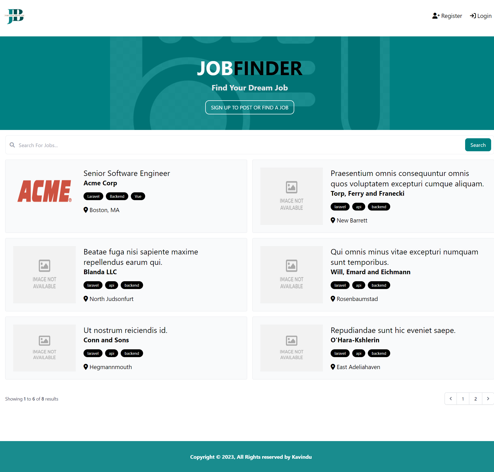

# JobFinder



## Table of Contents

- [Introduction](#introduction)
- [Project Documentation](#project-documentation)
- [Features](#features)
- [Prerequisites](#prerequisites)
- [Getting Started](#getting-started)
- [Technologies Used](#technology-used)
- [License](#license)

## Introduction <a name="introduction"></a>

For this assignment a Customer Relationship Management (CRM) system was developed for a job
finding agency called JobFinder. A web solution was proposed with the implementation of a CRM
to the agency to further improve their job finding.

This website solution contains 3 user roles. The
business role is for companies, and it allows them to post jobs for their companies. The employer
role is for job applicants who can view the jobs posted by businesses and apply to them if they
want to. The administrator role is for the job agency where they can view the analytical data
provided by the information available.

This README provides an overview of the project, how to get started, and how to contribute.


## Project Documentation <a name="project-documentation"></a>

The project document can be accessed [here](Document/SSP2-Report.pdf).

## Features <a name="features"></a>

- Efficient and effective job finding through names and keywords.
- Businesses can post job openings with detailed information.
- Job seekers can search and apply for jobs posted by businesses.
- User authentication and authorization for all user roles.
- User-friendly interface for easy navigation.
- Admin dashboard for the job agency to view analytical data.
- User management for the job agency to manage users.
- Job management for the job agency and businesses to manage jobs.
- Integrated CRM system for the job agency to manage their customers.
- Integrated email system for the job seekers to email their CVs to businesses.

## Prerequisites <a name="prerequisites"></a>

Before you get started with the project, make sure you have the following requirements installed:

- Node.js: [Download Node.js](https://nodejs.org/)
- PHP 8 or higher: [Download PHP](https://www.php.net/downloads)
- Composer: [Download Composer](https://getcomposer.org/download/)
- WAMP Server: [Download WAMP Server](https://www.wampserver.com/en/)

## Getting Started <a name="getting-started"></a>

1. Clone the repository:

   ```bash
   git clone https://github.com/YourUsername/JobFinder.git
   ```
2. Change into the project directory:

   ```bash
   cd JobFinder
   ```
3. Install the dependencies:

   ```bash
   composer install
   ```
4. Create a copy of the `.env.example` file and rename it to `.env`:

   ```bash
   cp .env.example .env
   ```
5. Generate an application key:

   ```bash
    php artisan key:generate
    ```
6. Migrate the database:

   ```bash
   php artisan migrate
   ```
   
7. Start the server:

   ```bash
   php artisan serve
   ```
   
## Technologies Used <a name="technology-used"></a>

- Frameworks: Laravel, Alpine.js (JavaScript), Tailwind CSS (CSS)
- Libraries: Font Awesome, Chart.js
- Languages: PHP, JavaScript
- Database: MySQL
- Mail Server: Mailtrap

## License <a name="license"></a>

The Laravel framework is and open-sourced software licensed under the MIT License - see the [LICENSE](https://opensource.org/licenses/MIT) file for details.


